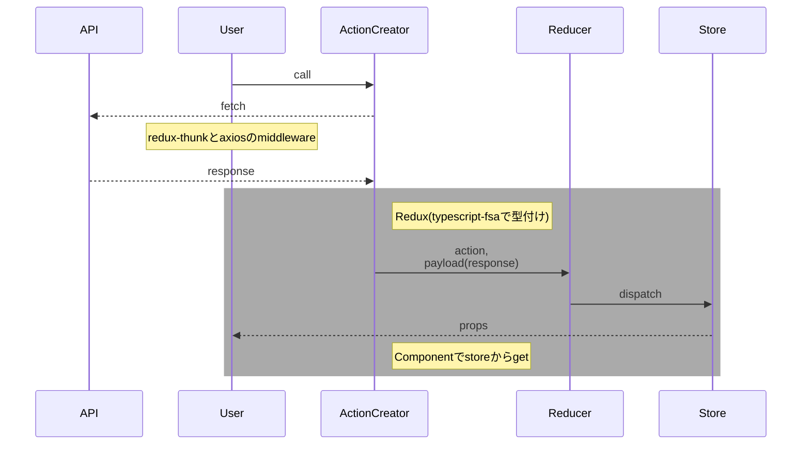

## PWA「新潟トイレマップ」

## 技術スタック
TypeScript/Node.js/React.js/React-Redux/typescript-fsa/prettier/styled-component/SPARQL/AWS EC2/Route53/Nginx

## アプリ概要
「ベビーカーや車椅子で外出したとき、トイレがない。」「使いたいのに目の前のトイレが混んでいる。」そんなとき、広いトイレを素早く探すことができるのが本アプリケーションです。スマホのホーム画面に追加してお使いください。

### 特徴
- 現在地近辺にあるベビーカーや車椅子で使用できるトイレを気軽に検索することができます。
- マップ画面からは目的地周辺にトイレが有るかどうか検索することが可能です
- マップ画面のピンをクリックすると描画されるトイレ名や、リスト画面のトイレ名をクリックするとマップアプリに遷移し、行き方がわかります
- トイレがない地域を赤色の円で確認することができます(実装予定)

## 制作背景
知り合いのベビーカーを使っている方が、でかけた先でベビーカーで使えるトイレがなくて困ったというエピソードを話しているのを聞きました。そこで調べてみると、ベビーカーの利用者は多機能トイレを普段つかっており、多機能トイレは数が少ない上車椅子利用者やオストメイトの方や、子連れの方など、様々な方が利用するため大変混雑しやすいという課題があることがわかりました。さらには、現行のアプリが使いにくいこともわかりました。そこで、多機能トイレのオープンデータをデータプラットフォームに登録し、開発したのが本アプリです。目的地周辺に多機能トイレがあるか・トイレが混雑していた場合に周囲に代替のトイレがあるかを簡単に検索することができます。

## 技術的工夫
- 当初開発したときJavaScriptで書かれていたものを、TypeScriptでリファクタリングしました。
- Redux-Thunk, typescript-fsaを利用してコンポーネントとロジックの分離を行なっています。
- 拡張性を意識して、ドメイン駆動設計の思想を少しずつ取り入れています。(ex. エンティティ→トイレの場所 / 値オブジェクト→緯度軽度, 現在の画面, など)
## アーキテクチャ

### データの流れ


### コンポーネント構成
```mermaid
flowchart
    App --> id1
    id1(Screen) --> id2(Map)
    id1(Screen) --> id3(List)

    subgraph Headerで表示切り替え
    id2
    id3
    end

    id1 --> id4(FirstView)

    id1(Screen) --> Tab

    id1 --> Closest

    Redux -- data -.-> id1
```


## デモ
- 目的地マップ画面


- 目的地検索後画面


- 目的地リスト表示画面


- 現在地近辺トイレ早見画面


- ファーストビュー画面

